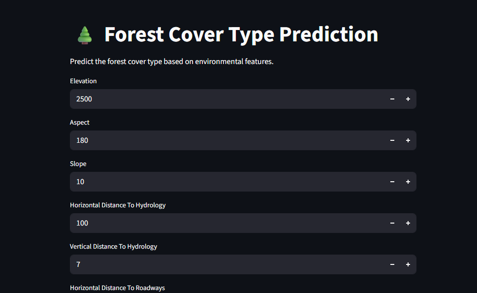

# Forest Cover Type Prediction Model



The Forest Cover Type Prediction Model is a Machine Learning application that predicts the type of forest cover for a 30m × 30m patch of land using geographical and environmental attributes. The system analyzes terrain, hydrology, hillshade, wilderness area, and soil characteristics to classify forest cover into one of seven forest types.

The project uses a Random Forest Classifier trained on the Forest Cover Type dataset and provides predictions through an interactive Streamlit web application.


## 🎯 Objectives

* Analyze forest cover data using Exploratory Data Analysis (EDA).
* Build a machine learning model for multiclass forest cover classification.
* Evaluate model performance using classification metrics.
* Deploy the model using Streamlit for real-time predictions.


## 📊 Dataset Features

### Numerical Features

| Feature                            | Description                                  |
| ---------------------------------- | -------------------------------------------- |
| Elevation                          | Elevation in meters                          |
| Aspect                             | Aspect in degrees azimuth                    |
| Slope                              | Slope in degrees                             |
| Horizontal_Distance_To_Hydrology   | Horizontal distance to nearest surface water |
| Vertical_Distance_To_Hydrology     | Vertical distance to nearest surface water   |
| Horizontal_Distance_To_Roadways    | Horizontal distance to nearest roadway       |
| Hillshade_9am                      | Hillshade index at 9 AM                      |
| Hillshade_Noon                     | Hillshade index at noon                      |
| Hillshade_3pm                      | Hillshade index at 3 PM                      |
| Horizontal_Distance_To_Fire_Points | Distance to nearest wildfire ignition point  |

### Categorical Features

* 4 Wilderness Area indicators
* 40 Soil Type indicators

### Target Variable

| Cover Type | Forest Type       |
| ---------- | ----------------- |
| 1          | Spruce/Fir        |
| 2          | Lodgepole Pine    |
| 3          | Ponderosa Pine    |
| 4          | Cottonwood/Willow |
| 5          | Aspen             |
| 6          | Douglas-fir       |
| 7          | Krummholz         |


## 🤖 Machine Learning Model


### Model Parameters

```python
RandomForestClassifier(
    n_estimators=200,
    random_state=42,
    n_jobs=-1
)
```


## 📈 Model Performance

### Accuracy

```text
87.47%
```

### Classification Report

```text
Precision: 88%
Recall: 88%
F1-Score: 88%
```

### Class-wise Performance

```text
Class 1 (Spruce/Fir)         : F1 = 0.79
Class 2 (Lodgepole Pine)     : F1 = 0.76
Class 3 (Ponderosa Pine)     : F1 = 0.86
Class 4 (Cottonwood/Willow)  : F1 = 0.96
Class 5 (Aspen)              : F1 = 0.92
Class 6 (Douglas-fir)        : F1 = 0.89
Class 7 (Krummholz)          : F1 = 0.97
```

## 🛠️ Technologies Used

* Python
* Pandas
* NumPy
* Matplotlib
* Seaborn
* Scikit-learn
* Joblib
* Streamlit

## 📁 Project Structure

```text
Forest Cover Prediction/
│
├── app.py
├── forest_cover_model.pkl
├── forestcoverpred.ipynb
├── train.csv
├── requirements.txt
├── README.md
└── Image.png
```

## 🚀 Installation

### Clone Repository

```bash
git clone https://github.com/malshiprabodha/Forest-Cover-Type-Prediction.git
cd Forest-Cover-Type-Prediction
```

### Install Dependencies

```bash
pip install -r requirements.txt
```

### Run Application

```bash
streamlit run app.py
```

## 🌐 Live Demo

```text
https://malshiprabodha-forest-cover-type-prediction-app-d2di7z.streamlit.app/
```


